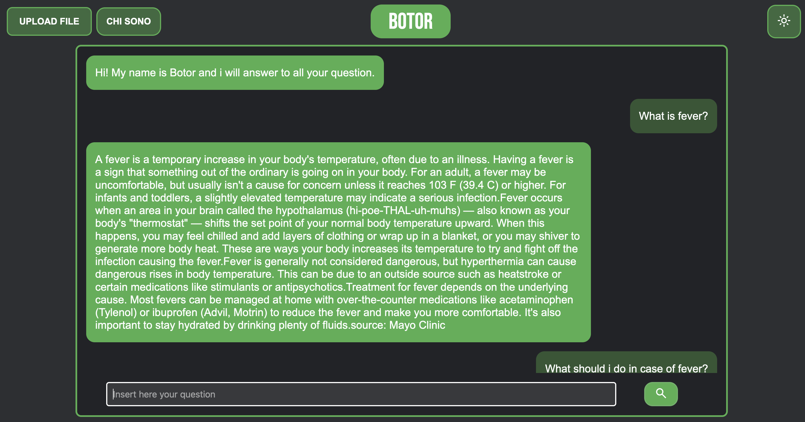

# Botor 🩺
This repository contains my university project for thesis.

## Requirements 📝
- Install [Python](https://www.python.org/);
- Install [Docker](https://www.docker.com/products/docker-desktop/).

## Instruction 📖
1. Launch the Docker application and run this two command:
   - docker pull qdrant/qdrant
   - docker run -p 6333:6333 qdrant/qdrant
3. Download the project and extract it
5. Edit the config.json with your API key and the name of your LLM.gguf
6. Open terminal and go to the located project folder
7. Then run this two commands: 
  - To create and load the Vector Database: python ingest.py (this operation require some minutes)
  - To run the Database: docker run -p 6333:6333 qdrant/qdrant
8. Now you can run this command and start to use Botor:
  - python botor.py

If everything is ok you can use the Botor app by reaching the address shown in the Port(s) section (for example http://localhost:9000).

## Demo 🎥

 
    

### Curiosity 🧐
The name "Botor" is the merge of "Bot" with the "Doctor".

#### Credits
Dataset: https://github.com/abachaa/MedQuAD
